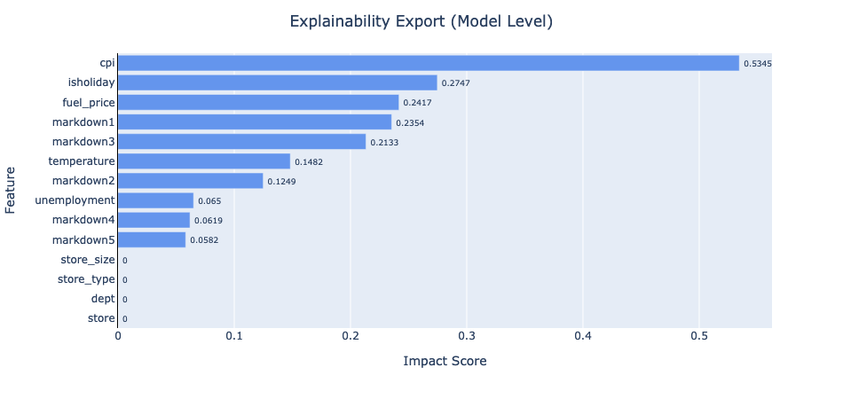
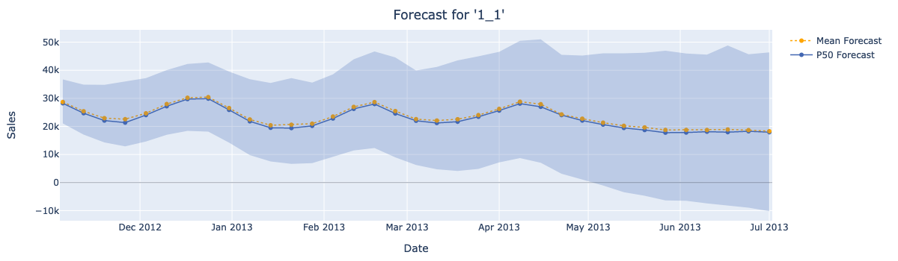

# Walmart Store Sales Forecasting with Amazon Forecast
### Goals
* Create a sales forecasting model with **Amazon Forecast** and use its many features.
* (Optional) Make interactive graphs using `plotly`.
### Requirements
* The dataset can be downloaded from [this Kaggle competition](https://www.kaggle.com/c/walmart-recruiting-store-sales-forecasting/overview/description).
* In addition to the Anaconda libraries, you need to install `awscli`, `boto3` and `plotly`. You must also set your AWS credentials appropriately.
## Workflow
|Steps|Sub-steps|Comments|
|:---:|:---:|:---:|
|Preliminary|Data wrangling|The data was preprocessed to consist of 3 datasets, i.e. CSV files: the target time series, the related time series, and the item metadata. |
|Preliminary|An **IAM Role** creation| |
|Preliminary|Uploading data to a **S3 bucket**|Since each item must have at least 5 time series values, 5 NaN value time series were created for cold start items.|
|Importing data|Dataset group creation| |
|Importing data|Datasets creation| |
|Importing data|Importing datasets| |
|A predictor training|*AutoPredictor* training|Since the competition evaluation criterion was WMAE, the model training metric was set to a similar WAPE.|
|A predictor training|Exporting backtests (item level)| |
|A predictor training|Creating and exporting explainability (model level)|A graph of the trained model explainability is shown below.|
|Forecasts generation|A forecast creation|The training period should be at least 4 times longer than the prediction period. As a result, not all of the prediction period values Kaggle requires were generated.|
|Forecasts generation|Querying forecast|The values of the prediction distribution for the sample item are shown in the graph below.|
|Insights exploration|Creating and exporting explainability (item level)|Up to 50 items and up to 500 data points are supported.|
  
The metrics of the trained model and the performance in Kaggle are as follows.
  
|Predictor Metrics|Values (vs. Kaggle 1st Score)|
|:---:|:---:|
|WAPE|0.1064|
|RMSE|3,887.86|
|MAPE|0.2671|
|MASE|1.1226|
|Avg. wQL|0.2631|
|Kaggle Public Score|3,384.72 (vs. 2,237.71)|
|Kaggle Private Score|3,521.34 (vs. 2,301.49)|

### References
* [Amazon Forecast Samples](https://github.com/aws-samples/amazon-forecast-samples)